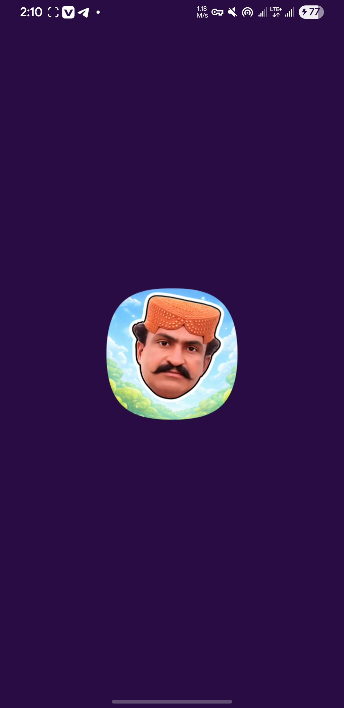
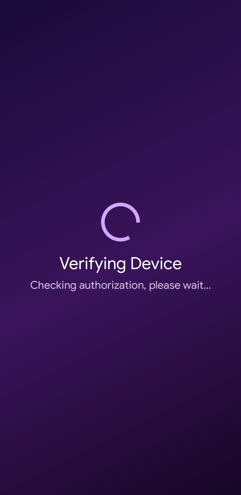
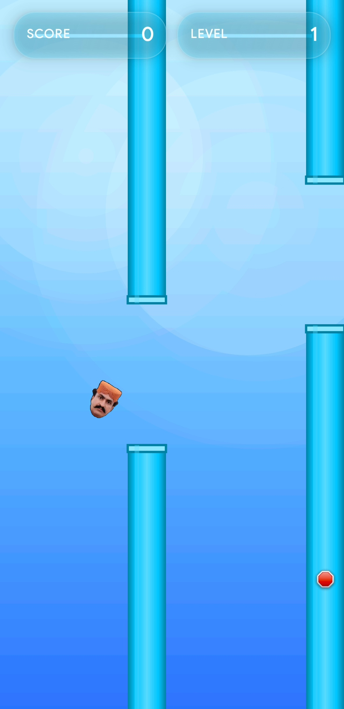
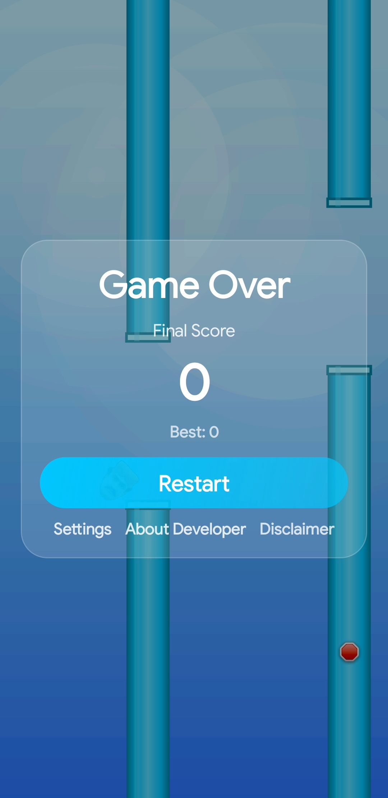
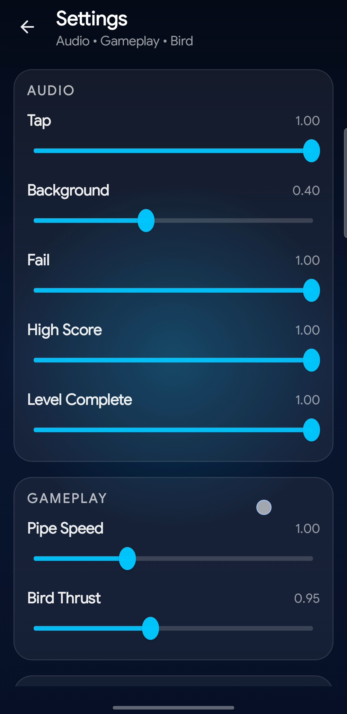
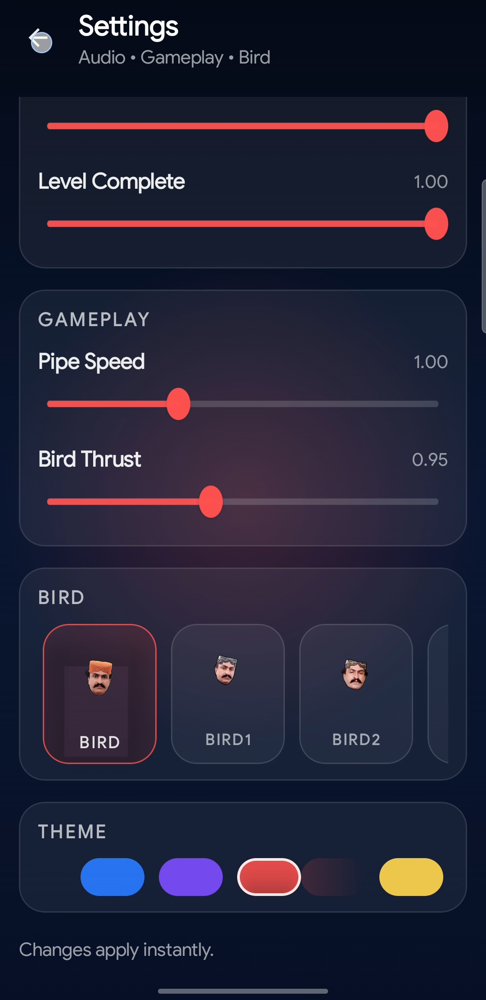
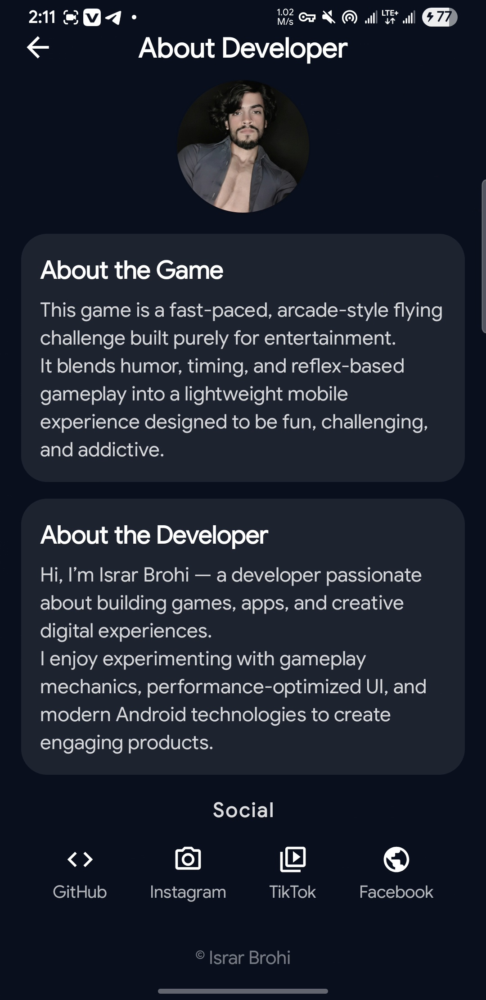
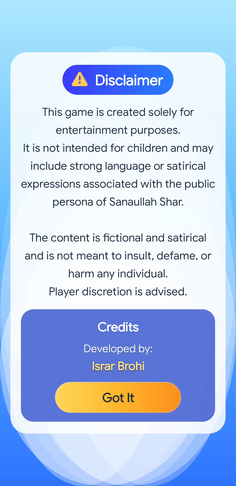

🎮 Sanaullah Shar – Flappy-Style Arcade Game (Android)

A fast-paced, arcade-style Android game inspired by classic Flappy mechanics, built with native Kotlin and Jetpack Compose for smooth performance and modern UI.

The game focuses on tight controls, progressive difficulty, and polished audiovisual feedback, delivering a challenging yet entertaining experience for casual and competitive players alike.

✨ Features

🐦 Tap & Hold Flight Mechanics
Responsive controls with adjustable thrust for precise movement.

🚧 Dynamic Pipes & Obstacles
Randomized pipe sizes, spacing, speed, and visual variations for replayability.

📈 Score & Level Progression
Glass-style HUD with animated score updates and level-up progression.

🎯 Level System
Levels advance automatically as score milestones are reached, with sound and visual feedback.

🔊 Rich Audio System

Background music

Multiple randomized fail sounds

Level-complete and high-score effects

User-configurable volume controls

🎨 Customizable Experience

Multiple bird characters

Theme color selection

Adjustable pipe speed and difficulty

⚙️ Settings & About Screens

In-game settings UI

Developer profile and game information

🔐 Device Authorization (Private Distribution)

This app uses device-based authorization to control where it runs.
Only approved devices can launch the game, making APK sharing ineffective for unauthorized users.

This project is not distributed via Google Play.

🔄 Update System

Uses GitHub Releases for APK hosting

Uses Firebase Remote Config for update metadata

Safe, non-intrusive in-app update notifications

No forced crashes or verification interference

🛠 Tech Stack

Language: Kotlin

UI: Jetpack Compose

Audio: Android Media APIs

Backend Services: Firebase (Remote Config only)

Build: Android Studio / Gradle

⚠️ Disclaimer

This game is intended strictly for entertainment purposes.

It is not designed for children and may include slang or humorous expressions attributed to a public persona in a satirical context.
No content is intended to insult, defame, or misrepresent any individual.

👨‍💻 Developer

Israr Brohi
Android Developer • Game Enthusiast • Electronics Technician
screenshots

<!-- Splash -->
<h3 align="center">🚀 Splash Screen</h3>

  

<!-- Authorization -->
<h3 align="center">🔐 Device Authorization</h3>

  
  

<!-- Gameplay -->
<h3 align="center">🎮 Gameplay</h3>

  
  

<!-- Settings -->
<h3 align="center">⚙️ Settings & Customization</h3>

  
  

<!-- Info -->
<h3 align="center">ℹ️ About & Legal</h3>

  
  

📄 License

This project is shared for learning and demonstration purposes.
Redistribution or modification without permission is not allowed.

